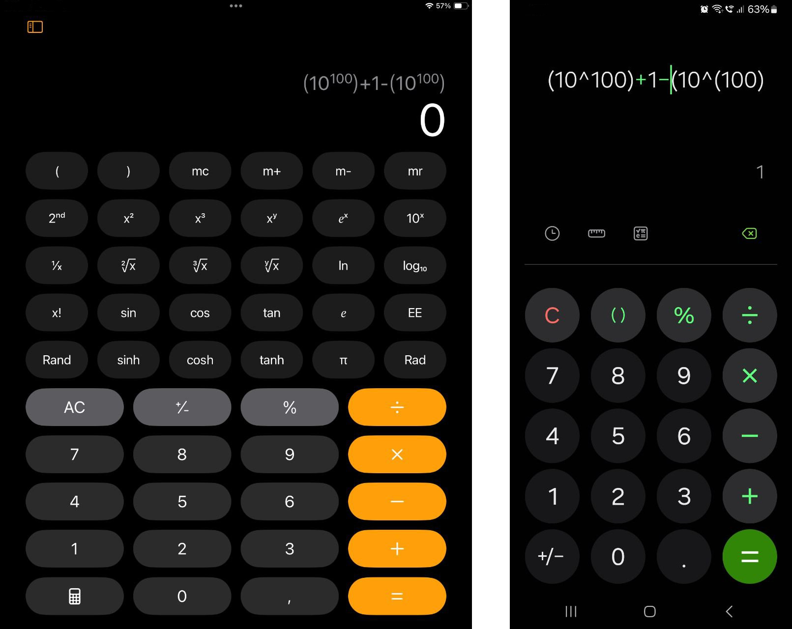

## Intro

Floats are exciting. We often assume that numerical results from computers are extremely accurate, but that’s frequently not the case. This happens because there are accurate and non-accurate ways to represent numbers. Accurate representations consume more storage, memory, and processing power compared to non-accurate ones. As a result, non-accurate forms - like floats - are often used in places you might not expect.

In fact, floats are everywhere! It’s actually more common to encounter a float than an accurate number. Many programming languages even default to treating numbers as floats, and special tricks are needed to handle numbers in an accurate form. The proccessing power of supercomputers is usually meassured in FLOPS which is -guess-... "Floating Point Operations Per Second".

Now that we know this, let’s dive deep into the non-accurate world of floating-point numbers.

The core idea behind floats is borrowed from scientific notation. For example, the approximate size of an atom in kilometers, ~0.0000000000001, can be represented as 1*10^-13. The first form uses 14 digits, while the second uses only 5.

The latter is much simpler, but floats add a layer of complexity. First, there isn't just one standard for storing floats - there are many. Thankfully, the most widely accepted standard is IEEE 754, which is the one you'll encounter almost everywhere and the one we'll focus on in this article. After this, IEEE 754 is a bit less straight-forward than scientific notation.

---

## IEEE 754

As we said before, there isn't only one standard for storing floats, but many. IEEE 754 is by far the most common. It breaks every floating-point number into three distinct parts, packed into either 32 bits (single-precision) or 64 bits (double-precision):

- **Sign Bit (1 bit)**: A single bit that decides whether the number is ***positive*** (`0`) or ***negative*** (`1`).
- **Biased Exponent** (*8 bits for 32-bit, 11 bits for 64-bit*): This isn't just any exponent. It's biased, meaning it's offset by a fixed value to allow for both positive and negative powers of 2. ***For 32-bit floats, the bias is 127***. So, an exponent of 0 is stored as 127, -1 as 126, and 127 as 254. ***For 64-bit floats, the bias is 1023***. This trick lets the hardware handle negative exponents without needing a sign bit for the exponent itself. The base is 2 because computers works with binary, so we need something in the form of `x*2^y`.
- **Mantissa** (*23 bits for 32-bit, 52 bits for 64-bit*): This stores the significant digits of the number, but the leading 1 is implied and not stored. For example, the binary number `1.0110` is stored as just `0110`, saving space but adding complexity. ***Notice how the mantissa length increases significantly from 23 bits in a 32-bit float to 52 bits in a 64-bit float.***

### IEEE 754 Example

A nice example is to calculate `3.14...` in IEEE 754.

We will assume that we are going to calculate a 32-bit IEEE 754 float. This is important, as based on the above, it changes the bias of the "Biased Exponent" to 127 and the length of the "Mantissa" to 23 bits.

#### I. Binary

- 3 in binary is `11`
- 0.14... in binary is `0.0010101111010111000...`

=>

- 3.14 in binary is `11.0010101111010111000...`

#### II. Biased Exponent

##### II.I. Exponent

First, we need to normalize `11.0010101111010111000...` to the form `1.xxx * 2^exponent`. Much like converting to scientific notation.

As with scientific notation, we have to use a little bit our fantasy. The only constraint is that the base of the exponent this time needs to be 2, so we need something like 2^-43 and not 10^-13.

All we need is to just convert to the `1.xxx * 2^exponent` form.

In this case, we will do this simply by doing a binary shift, but this is just an example of our case.

`11.0010101111010111000...` -> `1.10010101111010111000... * 2^1`

By converting to `1.xxx * 2^exponent` form we see that our exponent is 1. 

##### II.II. Biased Exponent

Our exponent is 1. But don't forget, as we said before, that in IEEE 754 we dont store the exponent, but a bias of the exponent ([...]This isn't just any exponent. It's biased, meaning it's offset by a fixed value to allow for both positive and negative powers of 2.[...]).

*We assumed that we are talking about a 32-bit float*, so our bias, based on what is written above, is 127.

So the number we will store is : the exponent + 127 => 1 + 127 = 128.

But we want this in binary. 128 in binary is `10000000`. That's our "Biased Exponent".

#### III. Mantissa

Take the first 23 bits (*because we assumed we are talking about 32-bit float*) after the `1.`, from the binary we found on the step I. : `10010101111010111000101` (truncated to fit). That's our "Mantissa".

#### IV. Split into IEEE 754 Parts

- **Sign**: `0` (positive)
- **Biased Exponent**: `10000000`
- **Mantissa**: `10010101111010111000101`

#### V. Result

Indeed, `0 10000000 10010101111010111000101` is the IEEE 754 of the number 3.14... You can verify this by using a handy IEEE 754 calculator [1].

---

## The (10^100) + 1 − (10^100) Problem

Open a calculator on an iPad or an iPhone and by switching to scientific mode, try to solve `(10^100) + 1 − (10^100)`. What you will get as a result is `0` which is obviously wrong, as the correct answer is `1`.

This is a snowball effect caused by the way float-pointing arithmetic works. This tiny `+1` gets lost into the inaccuracy of float arithmetic when is added to such a big number as `10^100`. 

Other calculators gets it correct, but this is thanks to relying to more mathematically advanced data structures of representing numbers. [2]

---

## The 0.1 + 0.2 Problem

On your favorite programming language, try to solve the simple `0.1+0.2`. What you will get is `0.30000000000000004`. This means that your language treats numbers as floats by default, as almost all languages do. 

This means as well that `0.1+0.2 == 0.3` is equal to... `false`. 

That's an interesting thing to know for the next time you will do mathematical operations. If float, take into account the inaccuracy that comes with, and do the proper tricks to ensure the required flexibility, or use a different way of representing your numbers if needed.

---

## Inifinity and "Not a Number" (NaN) (IEEE 754)

Two very interesting mathematical concepts that are impossible to represent in any other... accurate form of numbers, are infinity and "not a number". A number can be infinite, and a number can be "not a number" temporarily, until it becomes a number, or simply because it's the result of a calculation like division with 0 - instead of error it's better to take "NaN" sometimes.

So IEEE 754 float numbers comes here to save the day if you need to represent those 2 very important mathematical concepts.

### Inifinity

If you raise all the numbers of the exponent and none of the mantissa, you get infinity ! (`0 11111111 00000000000000000000000`)

### "Not a Number" (NaN)

"Not a Number" is a special case of number meant as a placeholder value for a numerical value that it's nit set yet or it was the result of an error, like for example from a division with 0 which is impossible.

(Talking about NaN, its actually very interesting that JSON, that it's a representation of values in a way that JS works, doesn't support NaN. JS, as many other languahes, treats numbers by default as floats, so it's interesting that JSON doesn't allow a number to be NaN. Instead, NaNs are usually converted to NULLs on most of the times when working with JSON.)

#### "Quiet NaN"

If you raise all the numbers of the exponent and the "most significant bit" of the mantissa (the first or the last, depends on the endianess), you get a "Quiet NaN". This NaN is natural and it doesnt trigger an error. (`0 11111111 00000000000000000000001` / `0 11111111 10000000000000000000000`).

#### "Signaling NaN"

If you raise all the numbers of the exponent and a bit that's not the "most significant bit" of the mantissa (like, just one in the middle, just to be sure), you get a "Signaling NaN". This NaN triggers an error. (`0 11111111 00000000000000000000010`).

---

## Outro

Floats may seem inaccurate, but this inaccuracy allows to handle bigger problems, as with huge numbers or with less hardware. 

Extreme accuracy is not always needed, let alone that it may not even exist in reallity.

Even if someone is interested only in extreme accuracy, floats are interesting to search about. By studying floats, one can reflect and understand the problem they try to solve and this is working with very big ranges, very unclear sets of numbers. Easily comes out of this the opposite, that a way to achive extreme accuracy, is actually to acknowledge that it's very subjective, so you eventually have  to limit the sets you are working with to something fixed.

This post was meant to unlock the secret world of float numbers in order for us to use them better.

---

## Links

 - [1] "IEEE-754 Floating Point Converter" [https://www.h-schmidt.net/FloatConverter/IEEE754.html](https://www.h-schmidt.net/FloatConverter/IEEE754.html)
 - [2] "A calculator app? Anyone could make that." [https://chadnauseam.com/coding/random/calculator-app](https://chadnauseam.com/coding/random/calculator-app)
